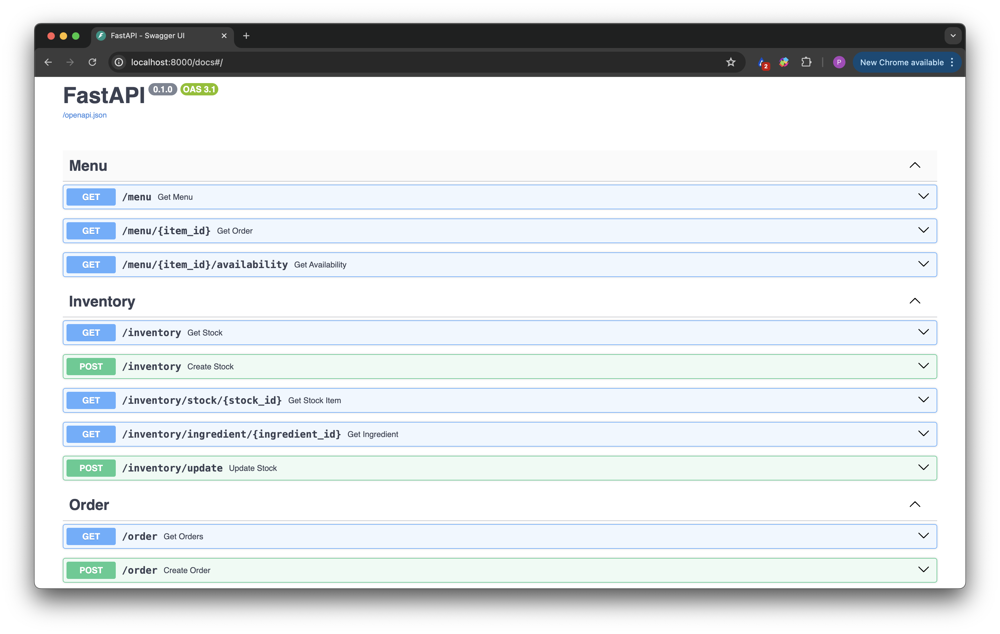
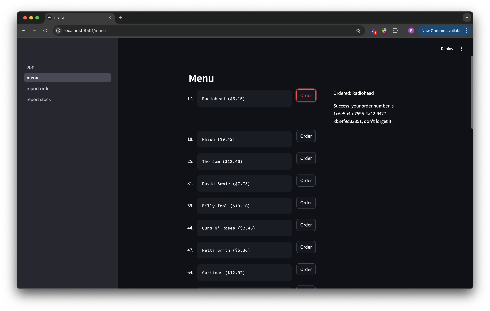
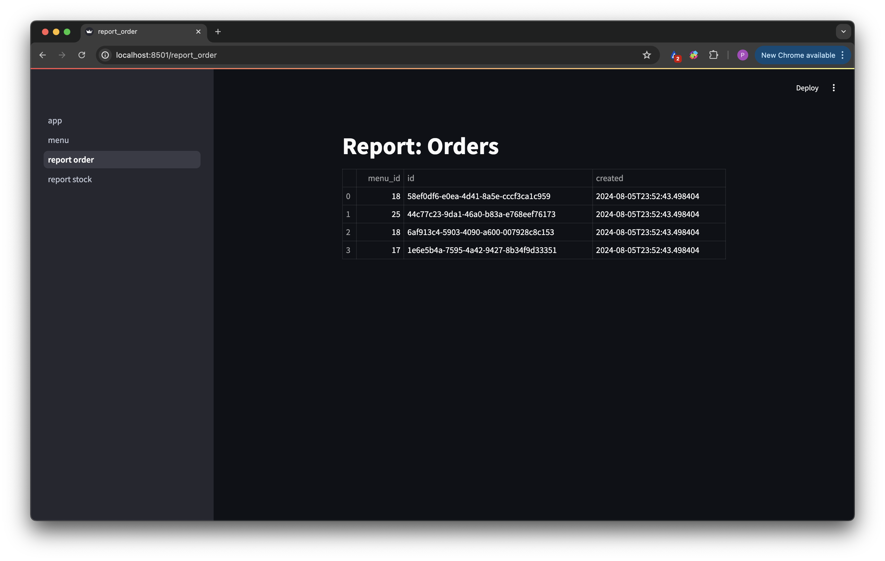

Overview
--------

This project provides a web app and backend, with the backend built on Python and SQLite. The architecture is "hexagonal", utilising a repository pattern (plus Unit of Work pattern; see `weird_salads/utils/unit_of_work.py`, or `https://github.com/PaulJWright/weird_salads/pull/7` for an overview of the initial Orders implementation) for data access.

Initial design documentation on the API, database, repository, and technologies can be found in the `weird_salads/README.rst` (`https://github.com/PaulJWright/weird_salads/blob/main/weird_salads/README.rst`). The repository is split into two services: Orders and Inventory. Integration of these services occurs through HTTP requests, although other methods were considered.

Start the Services
==================

To get started, run the following commands (for a more complete breakdown, see `/docker/README.rst`):

.. code-block:: bash

    cd docker
    docker compose up --build

Here, the `docker-compose.yml` file defines the `location_id` and `quantity` that are used for seeding the database from empty (`weird_salads/utils/database/seed_db.py`). This seeding is performed from `data/*.csv` files, which are downloaded sheets from the provided Google Sheet document. The following example during initialization shows that the seeding process is complete for location 1 with a quantity of 1000 for each ingredient.

.. code-block:: bash

    fastapi-1    | INFO - Starting data seeding process
    fastapi-1    | INFO - Seeding completed successfully for location 1 and quantity 1000.0.

Once these services are running, the FastAPI endpoints can be accessed at `http://localhost:8000`, and the Streamlit frontend at `http://localhost:8501`. The FastAPI Docker container interacts with a SQLite database located at `/data/orders.db`, which can easily be viewed through a GUI, such as `https://sqlitebrowser.org/dl/`.

FastAPI
=======

An overview of the FastAPI endpoints (designed here: `https://github.com/PaulJWright/weird_salads/blob/main/weird_salads/README.rst`) is shown below:

This is semi-complete, allowing various tasks, such as:

* Selling items (POST `/order`)
* Accepting deliveries (POST `/inventory`)

These are the primary tasks involved in the business.

Other tasks, such as taking stock, can be completed through various endpoints (e.g. viewing inventory, updating), and reports are better suited to the frontend.

The working ordering system can be demonstrated by executing an order on `http://localhost:8000/docs#/Order/create_order_order_post`, for example `menu_id = 18`, which will return a response like:

.. code-block:: json

    {
        "menu_id": 18,
        "id": "e893be34-b95e-4a94-8c46-9da9d2bca288",
        "created": "2024-08-05T23:52:43.498404"
    }

This can be verified at `http://localhost:8000/docs#/Order/get_orders_order_get`, for example:

.. code-block:: json

    [
        {
            "menu_id": 18,
            "id": "e893be34-b95e-4a94-8c46-9da9d2bca288",
            "created": "2024-08-05T23:52:43.498404"
        }
    ]

You can get more information on a certain menu at `/menu/`, and specific details on an item, including ingredients, at `/menu/{item_id}`. For availability information, there is also the `/menu/{item_id}/availability` endpoint, which can be checked before and after a POST to the `/order` endpoint.

Streamlit
=========

The Streamlit frontend is unfortunately lacking in features, particularly in error handling, as this was my first time using Streamlit (chosen as a simple frontend solution).
Simple fixes would be to propagate the errors properly from the API endpoints, and add filtering functionality to create the reports

> The working ordering system can be demonstrated by clicking an order, and checking the order reports page, which should display the UUID for the order.

Notes
=====

**Positives:**

* I spent time on the first day designing the API and database, knowing that I wanted to build on the repository pattern. I chose to prioritise this to reduce the scope of the project and to get a better time estimate for completion.
* I prioritised seeding the database with a certain location to reduce the handling of `staff` and `locations` tables.

**Negatives:**

* I wish I had spent more time properly writing unit and integration tests. This is the next thing I would do if I had more time.
* Type hinting and docstrings are incomplete, another thing I will do with more tmie.
* I would like to further understand how to implement a proper frontend with error handling using a technology such as React.
* The handling of units in the deduction of ingredients is not complete and was an oversight.

**Summary:**

Overall, I limited the scope through:

* Fixing a location in the database seeding,
* Primarily concentrating on selling orders and accepting deliveries,
* Concentrating on merge requests that addressed end-to-end changes from the database through to the frontend app, to provide a complete app from the beginning.

**Further basic scratch notes:**

* Docker: `https://github.com/PaulJWright/weird_salads/blob/main/docker/README.rst`
* Database: `https://github.com/PaulJWright/weird_salads/blob/main/database/README.rst`
* API/Database/Repo: `https://github.com/PaulJWright/weird_salads/blob/main/weird_salads/README.rst`
* Initial OrdersService/OrdersRepository implementation: https://github.com/PaulJWright/weird_salads/pull/7

Developing
==========

To get started locally, you can install the package and use it as follows:

.. code:: bash

    pip install -e .

Then you can import the utility functions in your Python script:

.. code:: python

    import weird_salads

This codebase uses pre-commit etc.

.. code:: bash

    pre-commit install

.. code:: bash

    (weird_salads) ➜  mad_salads git:(feature/initial_setup) ✗ pre-commit run --all
    ruff.....................................................................Passed
    black....................................................................Passed
    isort....................................................................Passed
    check python ast.........................................................Passed
    check for case conflicts.................................................Passed
    trim trailing whitespace.................................................Passed
    check yaml...............................................................Passed
    debug statements (python)................................................Passed
    check for added large files..............................................Passed
    fix end of files.........................................................Passed
    mixed line ending........................................................Passed
    codespell................................................................Passed

License
-------

This project is Copyright (c) Paul Wright and licensed under
the terms of the GNU GPL v3+ license. This package is based upon
the `Openastronomy packaging guide <https://github.com/OpenAstronomy/packaging-guide>`_
which is licensed under the BSD 3-clause licence. See the licenses folder for
more information.

Contributing
------------

We love contributions! weird_salads is open source,
built on open source, and we'd love to have you hang out in our community.

**Imposter syndrome disclaimer**: We want your help. No, really.

There may be a little voice inside your head that is telling you that you're not
ready to be an open source contributor; that your skills aren't nearly good
enough to contribute. What could you possibly offer a project like this one?

We assure you - the little voice in your head is wrong. If you can write code at
all, you can contribute code to open source. Contributing to open source
projects is a fantastic way to advance one's coding skills. Writing perfect code
isn't the measure of a good developer (that would disqualify all of us!); it's
trying to create something, making mistakes, and learning from those
mistakes. That's how we all improve, and we are happy to help others learn.

Being an open source contributor doesn't just mean writing code, either. You can
help out by writing documentation, tests, or even giving feedback about the
project (and yes - that includes giving feedback about the contribution
process). Some of these contributions may be the most valuable to the project as
a whole, because you're coming to the project with fresh eyes, so you can see
the errors and assumptions that seasoned contributors have glossed over.

Note: This disclaimer was originally written by
`Adrienne Lowe <https://github.com/adriennefriend>`_ for a
`PyCon talk <https://www.youtube.com/watch?v=6Uj746j9Heo>`_, and was adapted by
weird_salads based on its use in the README file for the
`MetPy project <https://github.com/Unidata/MetPy>`_.
