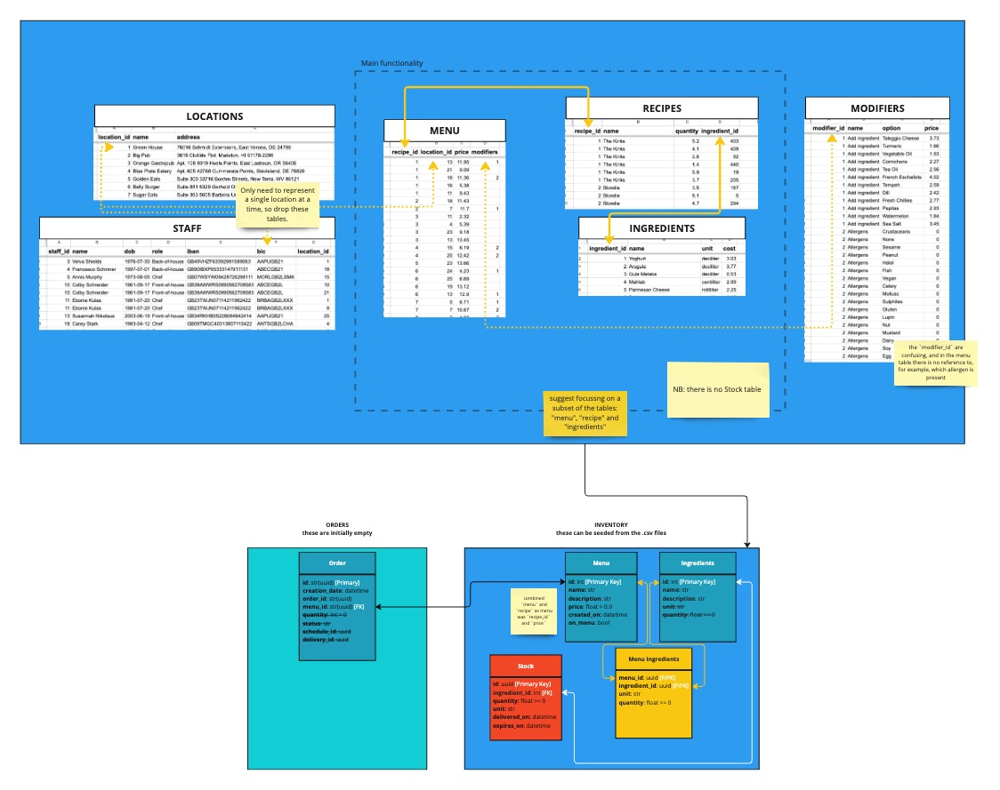

Overview
--------

Potential Technologies:
=======================

* api (FastAPI)
* data [small data files (if needed), probably where the SQLite DB will be stored...]
* database (scripts alembic migrations)
* inventory [deals with inventory-related tasks]
* order [deals with the order tasks]
* streamlit_app (streamlit frontend)
* tests [openastronomy location for tests]

API Design
==========

The requirements state:

    Staff need to perform the following actions in the app:

    - **Accept deliveries**: When a delivery of fresh ingredients arrives, the chef or another back-of-house employee will add the quantity of the delivered inventory items accordingly.
    - **Sell items**: When an item on the menu is sold at the front-of-house, the ingredients associated with it are removed accordingly. It must not be possible to sell an item for which not enough ingredients are in stock.
    - **Take stock**: Periodically, staff will count all of the inventory in the store and compare with the quantities in the system. Sometimes, the inventory counted does not match the data: ingredients could’ve spoiled or been dropped (waste).
    - **Pull reports**: The location manager wants to view a report every month, showing all the inventory movements: who did what to change the inventory when and by how much. They also want a summary containing:
        - total cost of all deliveries
        - total revenue from all sales
        - total value of current inventory
        - cost of all recorded waste

and as such, an initial API design is below:

.. image:: ../docs/misc/api_design.jpg
  :alt: API design

where to

    - **Accept deliveries**: POST /inventory
    - **Sell items**: POST /orders
    - **Take stock**: GET /inventory
    - **Pull reports**:
        - total cost of all deliveries: POST /inventory with filters on `delivery_date`
        - total revenue from all sales: GET /orders with filters on `delivery_date`
        - total value of current inventory: GET /inventory
        - cost of all recorded waste: **NOT IMPLEMENTED**

Database Design
===============

There are a number of tables in the provided, and the requirements state:

    Each location has its own menu and inventory needs. The application should restrict all actions to the recipes and ingredients on the location's menu, and to the staff employed at that specific location.
    [...] When the stores open for business next time, **they will boot up your app and see their latest data and be ready to use by the staff**.
    Keep in mind that restaurant staff are very busy and typically not very technical - people will be performing any or all of these tasks at the same time and often under pressure.

With the bold in mind, we can seed the database, and simplify the provided excel sheet, e.g.:

NB: The thought was to possibly start with SQLite for simplicity of storing as a `.db` file, but as this doesn't deal with UUID we need str(UUID) (as reflected in the above design diagram)

Repository Design
=================

Below is the proposed directory structure for the `weird_salads` project:

.. code-block:: text

    weird_salads/
    ├── weird_salads/                   # Main application package
    │   ├── README.rst
    │   ├── data/                       # Small data-related files (/SQLite DB)
    │   ├── database/                   # DB related utils, e.g. alembic
    │   ├── api/                        # FastAPI-related code
    │   │   ├── __init__.py
    │   │   ├── app.py                  # FastAPI app and routers
    │   │   ├── endpoints/
    │   │   ├── schemas/
    │   │   │   ├── orders_schema.py    # Orders Pydantic schemas
    │   │   │   └── inventory_schema.py # Inventory Pydantic schemas
    │   │   └── ...
    │   ├── inventory/                  # Inventory module
    │   │   ├── inventory_service/      # Business logic
    │   │   │   ├── exceptions.py       # inventory-specific exceptions
    │   │   │   ├── inventory_service.py
    │   │   │   └── ...
    │   │   ├── repository/             # Data layer access
    │   │   │   ├── __init__.py
    │   │   │   ├── inventory_repository.py
    │   │   │   ├── models.py
    │   │   │   └── ...
    │   │   └── ...
    │   ├── orders/                     # Orders module (similar to Inventory)
    │   │   ├── orders_service/
    │   │   │   ├── exceptions.py
    │   │   │   ├── orders_service.py
    │   │   │   └── orders.py
    │   │   ├── repository/
    │   │   │   ├── orders_repository.py
    │   │   │   ├── models.py
    │   │   │   └── ...
    │   │   └── ...
    │   ├── streamlit_app/              # Streamlit frontend
    │   ├── tests/                      # Unit and integration tests
    │   ├── utils/                      # Shared utility functions
    │   │   ├── unit_of_work.py         # Unit of work for transaction management
    │   │   └── ...
    │   └── version.py                  # Version information
    └── ...
